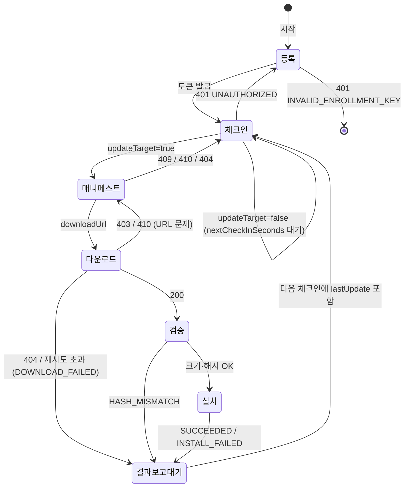

# OTA 전체 흐름

- 근거: Notion `API 설계` 데이터베이스 (각 API 상세 페이지, `도메인별 테이블`)
- 상태: 모든 API `설계중` (v1)
- 인증은 초반에 약하게 가져가기로 합의함. 비즈니스 로직에 복잡하게 넣지 않는다.

## 0. 등장 주체

| 주체 | 역할 |
|---|---|
| 관리자 | 업데이트 파일 등록, 캠페인 등록 |
| OTA 서버 | 파일 메타데이터·캠페인·차량 상태 관리, 대상 판정, 매니페스트 발급, SSE 전송 |
| Origin File Server | 업데이트 파일 원본 저장소 |
| CDN | 차량에 파일 배포. 캐시 미스면 Origin에서 가져옴 |
| 차량 | 등록, 주기적 체크인, 다운로드·검증·설치, 결과 보고 |
| 프론트엔드 | 대시보드 (스냅샷 + SSE) |
| DB (MySQL) | `artifact`, `campaign`, `campaign_target_hw_version`, `campaign_target_region`, `vehicle`, `vehicle_credential`, `vehicle_state`, `update_result` |


## 2. 단계별 흐름

### ① Origin 파일 등록 (관리자)

`POST /api/v1/admin/artifacts` · `multipart/form-data` · `Bearer {admin-token}` · ORIGIN-REQ-001 / ORIGIN-POL-001

1. 관리자가 `file`, `model`, `version`, (선택) `sha256`을 올린다.
2. OTA 서버가 SHA-256을 계산한다. 요청에 `sha256`이 있으면 비교한다 → 다르면 `422 HASH_MISMATCH`.
3. Origin File Server에 업로드한다 → 실패하면 `502 ORIGIN_UPLOAD_FAILED` (재시도).
4. `artifact` 테이블에 저장하고 `201`로 `artifactId`, `fileSize`, `sha256`, `path`를 돌려준다.

- Phase1에서는 Ed25519 서명을 만들지 않는다. Phase2에서 다룬다 (§7 참고).

규칙
- 같은 `model + version`이 있으면 `409 ARTIFACT_VERSION_EXISTS`.
- 등록한 파일은 수정하지 않는다. 버전마다 새 Origin 경로 (`/firmware/{model}/{version}/firmware.bin`).
- 실패하면 캠페인에 연결할 수 있는 상태가 되지 않는다.

`GET /api/v1/admin/artifacts?model=` 로 캠페인 등록 때 고를 파일 목록을 조회한다.

### ② 캠페인 등록 (관리자)

`POST /api/v1/admin/campaigns` · `Bearer {admin-token}` · CAMPAIGN-REQ-001 / CAMPAIGN-POL-001

요청: `name`, `artifactId`, `targetVersion`, `target{model, hwVersions[], regions[], currentVersionMin, currentVersionMax}`, `startAt`, `endAt`

1. `artifactId`의 파일이 있는지 확인 → 없으면 `404 ARTIFACT_NOT_FOUND`.
2. `targetVersion == artifact.version`, `startAt < endAt` 확인 → 아니면 `400 INVALID_REQUEST`.
3. 같은 대상 조건 + 목표 버전의 활성 캠페인이 있으면 `409 ACTIVE_CAMPAIGN_EXISTS` (여러 테이블에 걸친 조건이라 앱에서 검사).
4. `campaign`, `campaign_target_hw_version`, `campaign_target_region`에 저장.
5. 등록 즉시 `ACTIVE` → 바로 체크인 대상 판정에 반영된다.

- 1:1 조건(`model`, `currentVersionMin`, `currentVersionMax`)은 `campaign`에, 1:N 조건(`hwVersions`, `regions`)은 별도 테이블에 저장한다.
- `hwVersions`, `regions`가 비어 있으면(행 없음) 전체가 대상.
- 목표 버전은 `artifact.version`과 같으므로 `campaign`에 따로 저장하지 않는다.

### ③ 차량 등록 · 토큰 발급 (차량)

`POST /api/v1/vehicles/register` · `Bearer {enrollment-key}` · VEHICLE-REQ-002 / VEHICLE-POL-003

요청: `vehicleId`, `model`, `hwVersion`, `region`, `currentVersion`

1. 공통 등록 키(`ENROLLMENT_KEY`) 확인 → 틀리면 `401 INVALID_ENROLLMENT_KEY` (차량은 시작 실패로 종료).
2. `vehicle`(`model`, `hw_version`, `region`)을 만들거나 갱신한다. 처음이면 `201`, 재등록이면 `200`.
3. `vehicle_state`의 `current_version`을 `currentVersion`으로 만들거나 갱신한다.
4. 기존 토큰을 폐기(`status = 'REVOKED'`, `revoked_at`)하고 새 토큰을 발급한다. 차량 하나에 유효 토큰은 하나.
5. 토큰은 SHA-256 해시로만 `vehicle_credential`에 저장한다. 원문은 이 응답에서 한 번만 내려준다.

- 차량은 토큰을 메모리에만 둔다. 재시작하거나 체크인에서 `401`을 받으면 다시 등록한다.
- 차종·HW·지역은 등록 때만 받는다. 바뀌면 재등록으로 반영한다.
- 등록 키로 다른 API를 부르면 `401`.

### ④ 체크인 · 대상 판정 · 결과 보고 (차량, 주기적)

`POST /api/v1/vehicles/{vehicleId}/check-in` · `Bearer {vehicle-token}` · VEHICLE-REQ-001, UPDATE-REQ-001 / VEHICLE-POL-001, VEHICLE-POL-002, UPDATE-POL-001

요청: `currentVersion`, `lastUpdate{campaignId, result, failureReason, failureDetail, finishedAt}` (없으면 null)

서버 처리
1. 경로의 `vehicleId`(= `vehicle.external_id`)로 `vehicle`을 조회해 `model`, `hw_version`, `region`을 가져온다. `vehicle`에는 쓰지 않는다.
2. `vehicle_state`의 `current_version`, `last_seen_at`(= DB `NOW(3)`)을 덮어쓴다.
3. `lastUpdate`가 있으면 `update_result`에 기록한다. `(vehicle_id, campaign_id)` 기준으로 덮어쓰므로 같은 결과가 두 번 와도 결과는 같다(멱등).
4. 대상 여부를 판정해 응답한다.

판정 규칙
- `vehicle`의 차종·HW·지역과 요청의 `currentVersion`이 활성 캠페인의 조건(차종, HW, 지역, 현재 버전 범위, 적용 기간)에 **모두** 맞으면 대상.
- `currentVersion`이 이미 목표 버전(`artifact.version`)이면 대상 아님.
- 활성 캠페인이 없으면 대상 아님.
- 버전은 문자열이라 SQL 범위 비교가 틀린다(`'1.0.10' < '1.0.9'`). 활성 캠페인을 `model`로 좁혀 가져온 뒤 앱에서 비교한다.

응답

```json
{ "updateTarget": false, "nextCheckInSeconds": 30 }
{ "updateTarget": true, "campaignId": "cmp-20261002-001", "nextCheckInSeconds": 30 }
```

오류: `401 UNAUTHORIZED` → 등록부터 다시, `403 VEHICLE_MISMATCH` (토큰 차량 ≠ 경로 vehicleId), `500` → 다음 주기에 재시도.

결과 보고(업데이트 결과 보고는 별도 API 없음)
- `SUCCEEDED`면 `currentVersion == targetVersion`, `FAILED`면 기존 버전을 보낸다.
- 차량은 `200`을 받으면 `lastUpdate`를 지우고, 응답을 못 받으면 다음 체크인에 다시 보낸다.

| failureReason | 상황 |
|---|---|
| `DOWNLOAD_FAILED` | CDN 오류, 연결 끊김, 크기 불일치, 재시도 초과 |
| `HASH_MISMATCH` | SHA-256 불일치 |
| `INSTALL_FAILED` | 설치 중 실패 |

### ⑤ 매니페스트 요청 (차량, 대상일 때)

`GET /api/v1/vehicles/{vehicleId}/campaigns/{campaignId}/manifest` · `Bearer {vehicle-token}` · MANIFEST-REQ-001 / MANIFEST-POL-001

1. 서버는 요청 시점에 대상 여부를 **다시** 확인한다.
2. 응답: `campaignId`, `targetVersion`, `fileSize`, `sha256`, `downloadUrl`(CDN 서명 URL), `urlExpiresAt`.

| HTTP | code | 상황 |
|---|---|---|
| 404 | `CAMPAIGN_NOT_FOUND` | 캠페인 없음 |
| 409 | `NOT_UPDATE_TARGET` | 대상 아님 (이미 목표 버전 포함) |
| 410 | `CAMPAIGN_INACTIVE` | 비활성 또는 기간 종료 |

- URL이 만료되면 이 API를 다시 호출해 새 URL을 받는다.

### ⑥ 업데이트 파일 다운로드 (차량 → CDN)

`GET {downloadUrl}` · OTA 서버 API 아님 · 인증 헤더 없이 서명 URL(`md5`, `expires` 쿼리)로 제한 · DOWNLOAD-REQ-001 / DOWNLOAD-POL-001

- 응답 `application/octet-stream`, 헤더 `X-Cache-Status: HIT | MISS`.
  - HIT: CDN 캐시에서 바로 응답.
  - MISS: CDN이 Origin에서 받아 캐시에 저장한 뒤 응답.

| HTTP | 상황 | 차량 동작 |
|---|---|---|
| 403 | 서명(md5) 틀림 | 매니페스트 재요청 |
| 404 | Origin에도 파일 없음 | 실패 처리, 다음 체크인에 `DOWNLOAD_FAILED` |
| 410 | URL 만료 | 매니페스트 재요청 후 다시 다운로드 |
| 502, 504 | CDN → Origin 오류 | 재시도 |

### ⑦ 검증 · 설치 (차량)

1. 받은 크기 == `fileSize`
2. SHA-256 == `sha256`
3. 하나라도 실패하면 재시도하거나 매니페스트를 다시 요청. 계속 실패하면 업데이트 실패.
4. 설치 → 성공/실패를 다음 체크인의 `lastUpdate`로 보고 (④로 돌아감).

- Phase1에서는 서명 검증을 하지 않는다. 출처 검증(Ed25519 서명)은 Phase2에서 다룬다 (§7 참고).

### ⑧ 대시보드 (프론트엔드)

**SSE를 먼저 연결하고 스냅샷을 받는다.** 반대 순서면 그 사이 변경분을 놓칠 수 있다.

`GET /api/v1/dashboard/vehicles/stream` · MONITORING-REQ-001 / MONITORING-POL-001
- OTA 서버(각 pod)가 약 1초마다 `vehicle_state`를 `updated_at` 기준으로 변경분 조회(기준 시각 DB `NOW(3)`) → 변경이 있을 때만 `event: vehicles` 전송.
- `id` = 이번 조회 기준 시각. 재연결 시 브라우저가 `Last-Event-ID`를 붙인다.
- `: keep-alive` 주석 15초 간격 (협의).
- 체크인마다 `last_seen_at`이 바뀌므로 `updated_at`도 바뀌어 변경분에 잡힌다.

`GET /api/v1/dashboard/vehicles` · MONITORING-REQ-004 / MONITORING-POL-001, MONITORING-POL-003
- `asOf` + 전체 `vehicles[]` 스냅샷.

공통 차량 필드: `vehicleId`, `model`, `currentVersion`, `campaignId`, `lastResult`, `failureReason`, `lastSeenAt`(온라인/오프라인 판단), `updatedAt`
- `vehicleId`, `model`은 `vehicle`, `currentVersion`, `lastSeenAt`, `updatedAt`은 `vehicle_state`, `campaignId`, `lastResult`, `failureReason`은 차량의 최근 `update_result`에서 가져온다.
- 결과 보고는 체크인과 같이 오므로 `vehicle_state.updated_at`도 함께 바뀌어 SSE 변경분에 잡힌다.

- 같은 차량이 스냅샷과 SSE에 모두 오면 `updatedAt`이 더 늦은 쪽을 쓴다.
- SSE가 다시 연결되면 스냅샷을 다시 받는다.

## 3. 차량 측 상태 흐름



## 4. 데이터 흐름 (테이블 기준)

FK 생성 순서: `artifact → campaign → campaign_target_hw_version, campaign_target_region → vehicle → vehicle_credential, vehicle_state → update_result`

| 단계 | 쓰기 | 읽기 |
|---|---|---|
| ① Origin 파일 등록 | `artifact` | - |
| ② 캠페인 등록 | `campaign`, `campaign_target_hw_version`, `campaign_target_region` | `artifact`, 활성 `campaign` |
| ③ 차량 등록 | `vehicle`, `vehicle_state`, `vehicle_credential` (기존 행 `REVOKED`, 새 행 추가) | `vehicle_credential` |
| ④ 체크인 | `vehicle_state`, `update_result` (`lastUpdate`가 있을 때) | `vehicle_credential`, `vehicle`, 활성 `campaign` + `campaign_target_*` + `artifact` |
| ⑤ 매니페스트 | - | `campaign`, `campaign_target_*`, `artifact`, `vehicle`, `vehicle_state` |
| ⑧ 대시보드 | - | `vehicle`, `vehicle_state` (`idx_vehicle_state_updated_at`), `update_result` |

주요 제약
- `artifact`: `UNIQUE(model, version)`, `UNIQUE(path)`, `sha256` 소문자 hex 64자, `size_bytes > 0`, `updated_at` 없음(불변).
- `campaign`: `status` = `ACTIVE / INACTIVE`, `CHECK (start_at < end_at)`, 체크인 판정용 `idx_campaign_status_model`.
- `vehicle`: 등록 때만 갱신. `external_id`(차량이 보내는 `vehicleId`)에 UNIQUE.
- `vehicle_credential`: `status` = `ACTIVE / REVOKED`, `REVOKED`일 때만 `revoked_at`. 생성 컬럼 `active_vehicle_id`, `active_token_hash`에 UNIQUE → 차량당 유효 토큰 1개, 유효 토큰 해시 중복 없음.
- `vehicle_state`: 체크인마다 덮어씀. 대시보드 스냅샷과 SSE의 출처.
- `update_result`: `UNIQUE(vehicle_id, campaign_id)`로 덮어써 멱등 처리. `result` = `SUCCEEDED / FAILED`, `FAILED`일 때만 `failure_reason`.

## 5. 인증 정리

| 호출 주체 | 방식 |
|---|---|
| 차량 (등록) | `Bearer {enrollment-key}` (공통 키) |
| 차량 (그 외) | `Bearer {vehicle-token}`, 토큰 차량 ≠ 경로 `vehicleId`면 `403` |
| 관리자 / 프론트엔드 | `Bearer {admin-token}` (발급 방식 협의) |
| SSE | `EventSource`가 헤더를 못 붙여서 쿠키 또는 쿼리 토큰 (협의) |
| CDN | 서명 URL (`md5`, `expires`) |

## 6. 제안 상태 API (흐름 보조)

| API | Endpoint | 설명 |
|---|---|---|
| 캠페인 목록 | `GET /api/v1/admin/campaigns` | 상태·차종 필터 |
| 캠페인 상세 | `GET /api/v1/admin/campaigns/{campaignId}` | 대상 조건·기간·상태 |
| 캠페인 비활성화 | `PATCH /api/v1/admin/campaigns/{campaignId}` | ACTIVE → INACTIVE, 배포 중지 |
| 캠페인 진행 현황 | `GET /api/v1/admin/campaigns/{campaignId}/stats` | 대상·진행·성공·실패(사유별) 집계 (`update_result`, `idx_update_result_campaign_result`) |
| Origin 파일 상세 | `GET /api/v1/admin/artifacts/{artifactId}` | 해시·경로 |
| 차량 상세 | `GET /api/v1/dashboard/vehicles/{vehicleId}` | 상세 + 마지막 업데이트 결과 |
| 차량 업데이트 이력 | `GET /api/v1/dashboard/vehicles/{vehicleId}/events` | `vehicle_event` 테이블 필요 |
| 헬스체크 | `GET /actuator/health` | k8s liveness/readiness |

## 7. 협의 필요 항목

- 관리자 토큰 발급 방식, SSE 인증 방식(쿠키/쿼리 토큰)
- 차량 토큰 만료 기간, 등록 키 교체 방법
- 체크인 주기(`nextCheckInSeconds` 기본값), 롤백 방식
- CDN URL 유효 기간, 다운로드 재시도 횟수·간격
- SSE keep-alive 간격 (현재 15초 안)
- 캠페인 비활성화·수정 API 필요 여부
- Origin 파일 목록 페이지네이션 필요 여부

### Phase2에서 다룰 항목

- 업데이트 파일 서명(Ed25519)
  - Phase1에서는 SHA-256 해시로 무결성만 확인하고, 파일 출처(서명)는 검증하지 않는다.
  - Phase2에서 추가할 것: 파일 등록 시 서명 생성(①), `artifact.signature` 컬럼, 매니페스트 `signature` 필드(⑤), 차량 내장 공개키로 검증(⑦), 실패 사유 `SIGNATURE_INVALID`.
  - 서명 키 보관·교체 방법도 함께 정한다.
